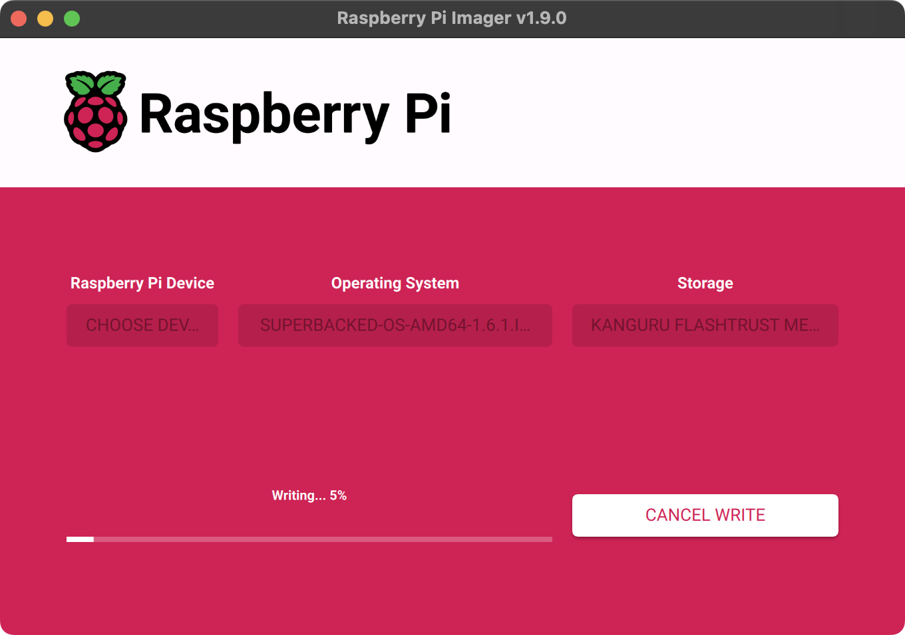
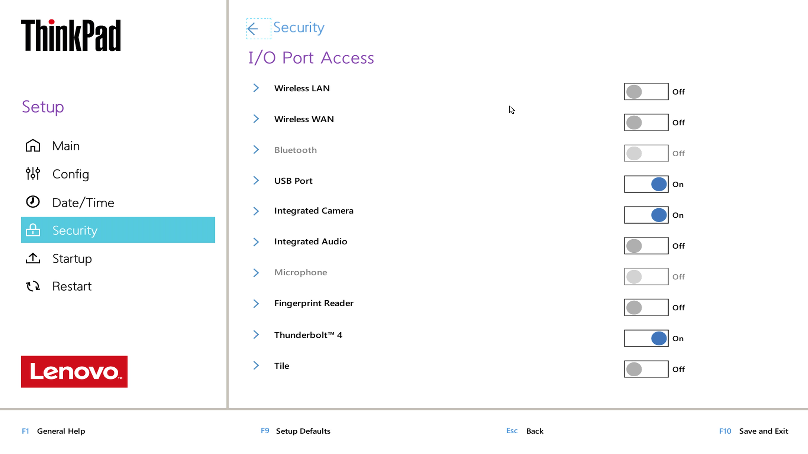
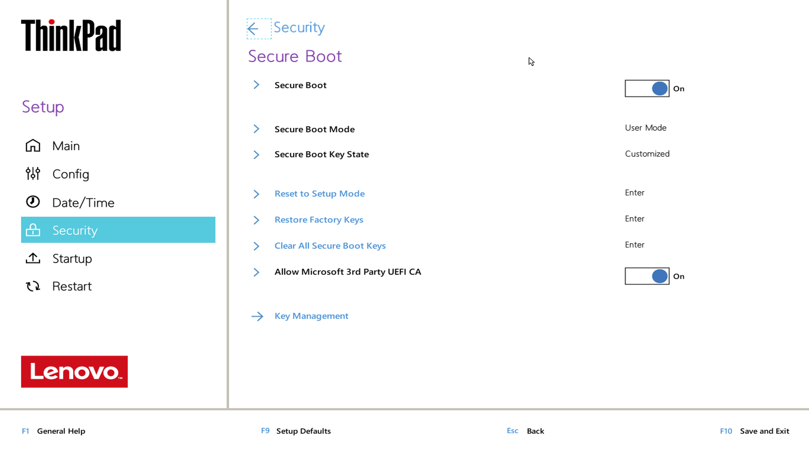
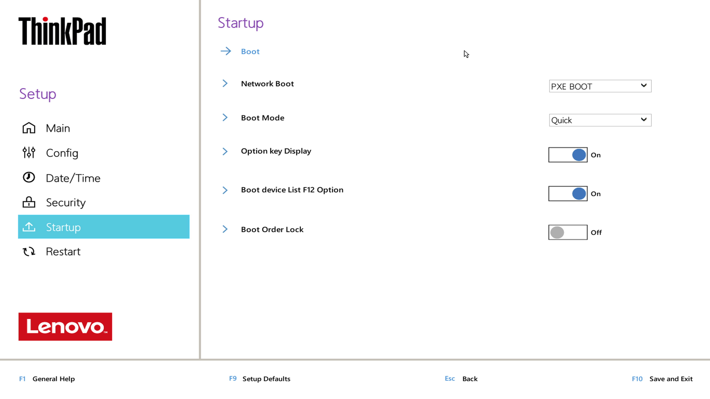

<!--
Title: How to run Superbacked OS on Intel computer
Description: Learn how to run Superbacked OS on Intel computer.
Publication date: 2025-01-11T09:58:30.556Z
Pinned: 1
-->

## Requirements

- Computer [compatible](https://ubuntu.com/download/desktop) with Ubuntu 24.04.1 LTS with 1080p camera
- USB flash drive (used to run Superbacked OS, 16GB min, faster is better)

## Recommendations (optional)

Physically removing internal disk(s) and wireless interface(s) if not soldered to motherboard or disabling interface(s) using BIOS if soldered is recommended to strengthen data persistence and air gap hardening.

Running Superbacked OS on flash drive with signed firmware and write protection enabled such as [Kanguru FlashTrust™ Secure Firmware USB 3.0 Flash Drive (WP-KFT3-16G)](https://www.kanguru.com/products/kanguru-flashtrust-secure-firmware-usb-3-0-flash-drive) is recommended.

## Superbacked OS USB flash drive guide

### Step 1: install [Raspberry Pi Imager](https://www.raspberrypi.com/software/)

#### macOS or Windows

Go to https://www.raspberrypi.com/software/, download and install Raspberry Pi Imager.

#### Ubuntu

> Heads-up: depends on [Qt](https://www.qt.io/).

```shell-session
$ sudo add-apt-repository -y universe

$ sudo apt install -y rpi-imager
```

### Step 2 (optional): disable Raspberry Pi Imager [telemetry](https://github.com/raspberrypi/rpi-imager#telemetry)

#### macOS

```shell-session
$ defaults write org.raspberrypi.Imager.plist telemetry -bool NO
```

#### Ubuntu

```shell-session
$ mkdir -p ~/.config/Raspberry\ Pi

$ cat << "EOF" > ~/.config/Raspberry\ Pi/Imager.conf
[General]
telemetry=false
EOF
```

### Step 3: download Superbacked OS

> Heads-up: for additional security, [verify](https://github.com/superbacked/superbacked?tab=readme-ov-file#how-to-verify-integrity-of-release) Superbacked OS release.

#### macOS or Ubuntu

```shell-session
$ cd ~/Downloads

$ for number in $(seq 1 2); do curl --fail --location "https://github.com/superbacked/superbacked/releases/download/v${latestRelease}/superbacked-os-amd64-${latestRelease}.img.xz.part$number" || break; done | cat > superbacked-os-amd64-${latestRelease}.img.xz
```

#### Windows

> Heads-up: requires WSL to be [installed](https://learn.microsoft.com/en-us/windows/wsl/install) first using `wsl --install` (if applicable).

> Heads-up: replace `Sun Knudsen` with your username.

```shell-session
$ wsl

$ cd /mnt/c/Users/Sun\ Knudsen/Downloads

$ for number in $(seq 1 2); do curl --fail --location "https://github.com/superbacked/superbacked/releases/download/v${latestRelease}/superbacked-os-amd64-${latestRelease}.img.xz.part$number" || break; done | cat > superbacked-os-amd64-${latestRelease}.img.xz
```

### Step 4: copy Superbacked OS to USB flash drive

Open “Raspberry Pi Imager”, click “CHOOSE OS”, then “Use custom”, select `superbacked-os-amd64-${latestRelease}.img.xz`, click “CHOOSE STORAGE”, select USB flash drive, click “NEXT”, then “NO” and, finally, click “YES”.



### Step 5 (optional): enable write protection

If using Kanguru FlashTrust™ Secure Firmware USB 3.0 Flash Drive or equivalent, enable write protection.

## Computer hardening guide

### Step 1 (optional): physically remove internal disk(s) and wireless interface(s) if not soldered to motherboard or disable interface(s) using BIOS if soldered



### Step 2 (if applicable): enable “Secure Boot” and disable “Boot Order Lock”





### Step 3: boot Superbacked OS

### Step 4: reboot

### Step 5 (if applicable): enable “Boot Order Lock”


## Usage guide

### Step 1 (if applicable): unplug Ethernet cable

### Step 2: boot Superbacked OS

> Heads-up: password is “superbacked”.

Boot Superbacked OS using “Advanced options for Ubuntu” and “Ubuntu, with Linux 6.8.0-52-generic” (required when using write-protected hardware).

If scanning blocks does not work, please try using a higher quality 1080p webcam such as the [Razer Kiyo X](https://www.razer.com/streaming-cameras/razer-kiyo-x).
